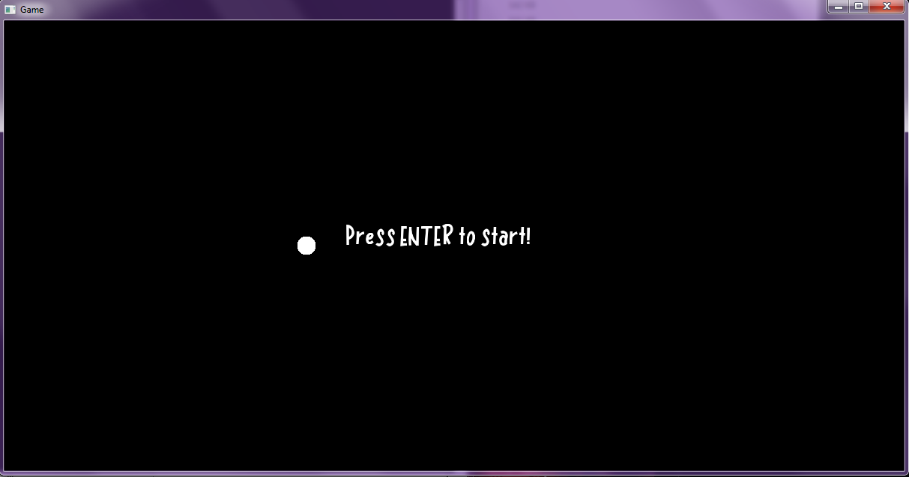
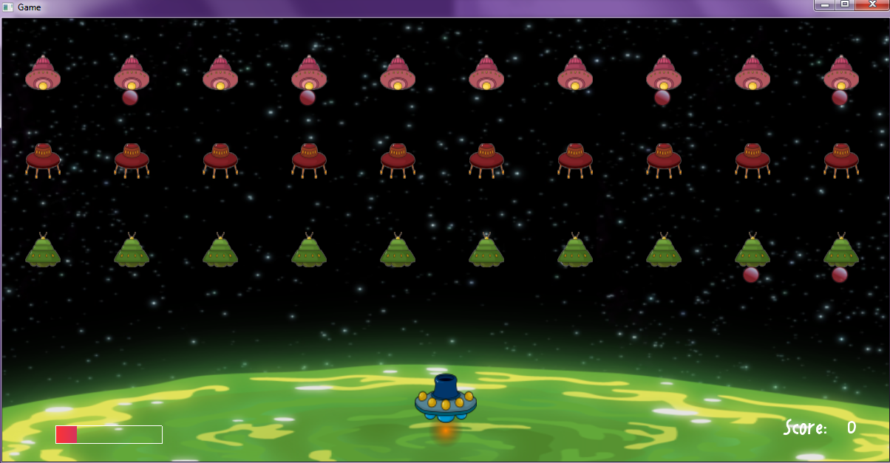
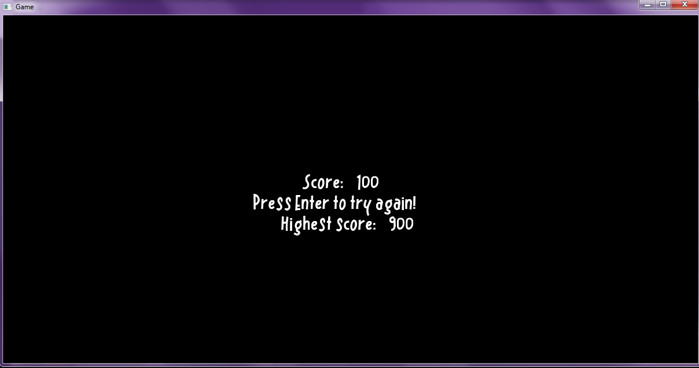

# **About this project**
> The purpose of this CPP project is to make a game that plays like Space Invaders, using only the [**Simple Game Graphics Library 1.0**](https://cgaueb.github.io/sgg/structgraphics_1_1_brush.html).

# **Contents**
- [**About this project**](#about-this-project)
- [**Contents**](#contents)
- [**How to run**](#how-to-run)
- [**How to play**](#how-to-play)
- [**Screenshots**](#screenshots)

# **How to run**

* To run this project in release mode, just run the `game.exe` file located in the [bin](game/bin) diretory.
* To run it in debug mode, run the `gamed.exe` file located in the [bin](game/bin) directory instead.

# **How to play**

> When you are in game a health bar can be seen in the bottom left corner of your screen. Your current score can be seen in the bottom right corner of the screen, you get 100 points for every spaceship you get to destroy. When in game, enemy spaceships will be spawned at the top, which move from left to right and also towards you. You have to destroy as many as you can before reaching you all killing you with their own bullets. After beating a stage, another one with the same lay out of enemy spaceships will spawn. Use the following controls to play.
>   * WASD for movement.
>   * Spacebar to shoot a bullet.

# **Screenshots**

* When you launch the game, your screen should look like so:
    
* The in-game screen:  
     
* When your health bar reaches 0, you will see the ending screen, showing your score after the round you just played and the highest score from all the rounds that you've played during this session. It should look like this:
    